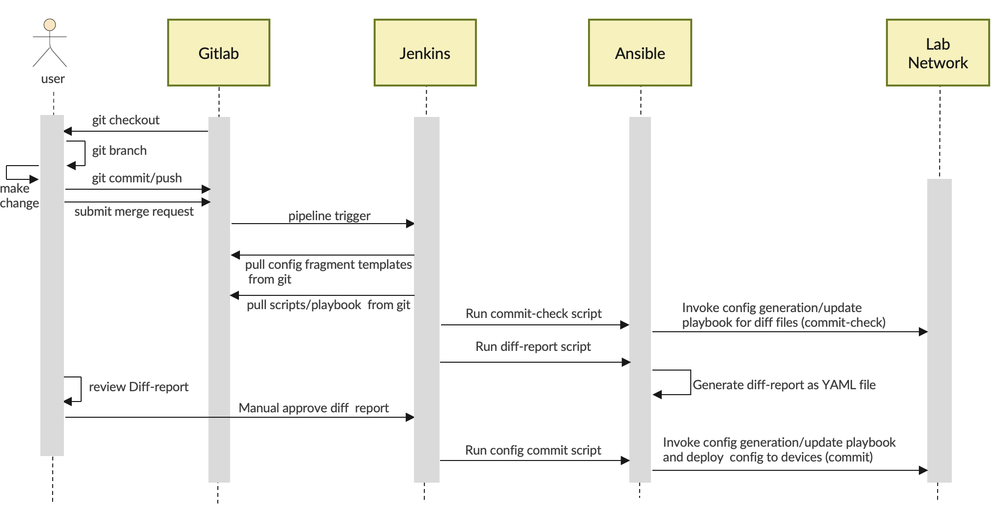
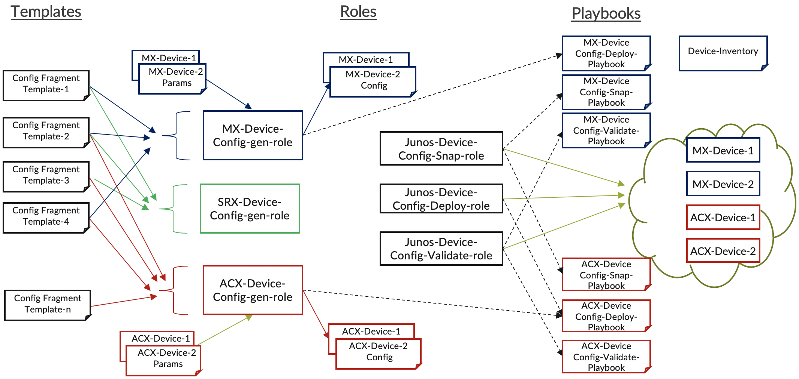

# Ansible Modules, Roles, Playbboks and Shell Scripts 

The [figure](../docs/Device_Config_Automation_Workflow.png) below describes Jenkins based workflow auomation for configuring JunOS devices.

## Modules 

- [xls_to_facts.py](library/xls_to_facts.py) : An Ansible module to convert data from Excell spreadsheet into JSON structure
- [jnpr_vnfstack.py](library/jnpr_vnfstack.py) : An example of Ansible module for external python example
- [gui_autologin_chrome.py](library/gui_autologin_chrome.py) : Selenium based example of autologin to web based application

## Templates 

- [jsnapy.cfg.j2](templates/jsnapy.cfg.j2) : Template for generating config for JSNAPy file locations
- [netdev_device_inventory.inv.j2](templates/netdev_device_inventory.inv.j2) : Template for generating an inventory file based on list of ip-addresses of junos devices
- [Subfolders for Config fragment templates](templates/)

The [figure](../docs/Ansible_Templates_Roles_Playbooks.png) below describes grouping of Junos config templates by device type as well as roles for generating, validating and uploading config to devices.

## Roles 
- [vnfstack](roles/vnfstack/) : Role to encapsulate the functionalities of jnpr_vnfstack Ansible module 
- [mx-junos-config](roles/mx-junos-config/) : A role for generating junos config files for MX devices based on collectiuon of templates
- [qfx-junos-config](roles/qfx-junos-config/) : A role for generating junos config files for QFX devices based on collectiuon of templates
- [junos-config-generate](roles/junos-config-generate/) : A role for generating junos config files for based on the list names of template fragment folders for a sepcifc deice type
- [junos-config-diff-report](roles/junos-config-diff-report/) : A role for generating report based on the commit-check run of the deployment of geerated config
- [junos-config-deploy](roles/junos-config-deploy/) : A role for deployinmg Junos comnfig to a device
- [junos-config-audit](roles/junos-config-audit/) : A role for autining a Junos config based pre and post config files

## Playbooks 

### Junos Device Related Utility Playbooks 
- [netdev_junos_device_upload_authorized_keys.yml](netdev_junos_device_upload_authorized_keys.yml) : Upload the SSH public keys to authitaion stanza for login user in Junos config
- [netdev_junos_inventory_gen.yml](netdev_junos_inventory_gen.yml) : Generates an inventory file based on list of IP-address and device facts 
- [netdev_device_exec_cli_terminal_pb.yml](netdev_device_exec_cli_terminal_pb.yml) : An utility script to open a terminal based windows with password less login to a set devices in inventory 

### Junos Device  Configuration Generationa and Deployment 
- [netdev_junos_config_gen_deploy.yml](netdev_junos_config_gen_deploy.yml) : An example Junos config deployment for any type of devices using a single roles - uses device-model-group exc ell spreadsheet to determine the mapping between device model group and template fragment folders; use  junos-config-deploy role to deploy the aggregated config
- [netdev_junos_config_diff_report.yml](netdev_junos_config_diff_report.yml) : An plaubook to generate an YAML rteport based on the diff files generaed during commit-check phase of deploy scripts - uses junos-confi-diff-report roles

### Junos Device  Configuration Audit 
- [netdev_junos_device_config_jsnapy_snap_check.yml](netdev_junos_device_config_jsnapy_snap_check.yml) : An all-in-one examples of JSNAPy pre/post/check actions playbook.
- [netdev_junos_device_config_jsnapy_snap.yml](netdev_junos_device_config_jsnapy_snap.yml) : A playbook invoked by audit template for taking config snapshot
- [netdev_junos_device_config_jsnapy_check.yml](netdev_junos_device_config_jsnapy_check.yml) : A playbook invoked by audit template for comparing pre and post config snapshot
- [netdev_junos_device_config_jsnapy_audit.yml](netdev_junos_device_config_jsnapy_audit.yml) : A plyabook which audits based on pre and post snapshots. The snapshots are related by a transaction-ids.

### Playbooks for Demo of Ansible Modules 
- [netdev_service_open_gui_pb.yml](netdev_service_open_gui_pb.yml) : A playbook demos the usage of the  [gui_autologin_chrome](library/gui_autologin_chrome.py) ansible module.
- [netdev_ansible_module_demo_vnfstack.yml](netdev_ansible_module_demo_vnfstack.yml) : A playbook demos the usage of the [vnfstack](roles/vnfstack/) role and  [jnpr_vnfstack.py](library/jnpr_vnfstack.py) module.

## Shell Scripts for Invoking the Playbboks  

- [run_netdev_junos_device_upload_authorized_keys.sh](run_netdev_junos_device_upload_authorized_keys.sh) : Uploads the SSH pub-key for a give login user for  given set of device list with `NETDEV_DEVICE_IP_LIST` env-var 
    - ` export NETDEV_DEVICE_IP_LIST=10.49.16.162,10.49.16.164,10.49.16.166 `
    - ` ./run_netdev_junos_device_upload_authorized_keys.sh  `
- [run_netdev_junos_inventory_gen.sh](run_netdev_junos_inventory_gen.sh) : Generates an inebtory file for given set of device list with `NETDEV_DEVICE_IP_LIST` env-var 
    - ` export NETDEV_DEVICE_IP_LIST=10.49.16.162,10.49.16.164,10.49.16.166 `
    - ` ./run_netdev_junos_inventory_gen.sh  `
- [run_netdev_device_exec_cli_terminal_pb.sh](run_netdev_device_exec_cli_terminal_pb.sh) : Looks up the ip-addresses of a specific host group in inentory and opens terrmanal window  for each ip-address and logins to to the host.
- [run_netdev_login_to_junos_devices.sh](run_netdev_login_to_junos_devices.sh) : Invokes `run_netdev_device_exec_cli_terminal_pb.sh` script for junos device group in inventory (MacOSX only)
- [run_netdev_login_to_servers.sh](run_netdev_login_to_servers.sh) : Invokes `run_netdev_device_exec_cli_terminal_pb.sh` script for server group in inventory 

- [run_netdev_junos_config_gen_deploy.sh](run_netdev_junos_config_gen_deploy.sh) : Script to ececute Ansible playbook for deploying juns config for any device; Generates the config based on the device model group name passed from the script using `DEVICE_GROUP_NAME` env-var and mapping between the group name and template fragment subfolder defined in the Excell spreadsheet
    - ` export DEVICE_GROUP_NAME=ACX2200 `
    - ` ./run_netdev_junos_config_gen_deploy.sh ` (by default the script runs commit-check and generated diff-report)
- [run_netdev_junos_config_gen_commitcheck.sh](run_netdev_junos_config_gen_commitcheck.sh) : Script to ececute Ansible playbook for deploying juns config for a group device (specied by `DEVICE_GROUP_NAME` env-var )using `run_netdev_junos_config_gen_deploy.sh` script - onlt does coomit0check to generate diff reports
    - ` export DEVICE_GROUP_NAME=ACX2200 `
    - ` ./run_netdev_junos_config_gen_commitcheck.sh `
- [run_netdev_junos_config_gen_commit.sh](run_netdev_junos_config_gen_commit.sh) : Script to ececute Ansible playbook for deploying juns config for a group device (specied by `COMMIT_DEVICE_INV_HOSTNAMES` env-var )using `run_netdev_junos_config_gen_deploy.sh` script - onlt does coomit0check to 
    - ` export DEVICE_GROUP_NAME=ACX2200 `
    - ` export COMMIT_DEVICE_INV_HOSTNAMES=vm101,vm102,vm103 ` (uses inventory hostname in inventory file)
    - ` ./run_netdev_junos_config_gen_commit.sh `
- [run_netdev_junos_config_diff_report.sh](run_netdev_junos_config_diff_report.sh) : Script to ececute Ansible playbook for generating diff reports based on the diff files generated during commitcheck script.
    - ` export DEVICE_GROUP_NAME=ACX2200 `
    - ` ./run_netdev_junos_config_gen_commit.sh `

- [run_netdev_junos_device_config_jsnapy_snap_check.sh](run_netdev_junos_device_config_jsnapy_snap_check.sh) :
- [run_netdev_junos_device_config_jsnapy_audit.sh](run_netdev_junos_device_config_jsnapy_audit.sh) : JSNAPy based config audit based on pre and post snapshots related by transaction id.
    - Look in to the [group_vars/all.yml](group_vars/all.yml) file for JNSAPy related variables 
- [run_netdev_junos_device_config_jsnapy_audit_pre.sh](run_netdev_junos_device_config_jsnapy_audit_pre.sh) : Invokes `run_netdev_junos_device_config_jsnapy_audit.sh`  for pre snapshot
    - ` export DEVICE_GROUP_NAME=ACX2200 `
    - `` export JSNAPY_TRANSACTION_ID=`date '+%m%d%H%M'` ``
    - ` ./run_netdev_junos_device_config_jsnapy_audit_pre.sh `
- [run_netdev_junos_device_config_jsnapy_audit_post.sh](run_netdev_junos_device_config_jsnapy_audit_post.sh) : Invokes `run_netdev_junos_device_config_jsnapy_audit.sh`  for post  snapshot and config verification
    - ` export DEVICE_GROUP_NAME=ACX2200 `
    - ` export JSNAPY_TRANSACTION_ID=XXXXX`
    - ` ./run_netdev_junos_device_config_jsnapy_audit_post.sh ` (use the sname `JSNAPY_TRANSACTION_ID` env-var use in pre snapshot script)
- [run_netdev_service_open_gui_pb.sh](run_netdev_service_open_gui_pb.sh) : Script to launch browser with auto-login to specifi GUI URL list
- [run_netdev_ansible_module_demo_vnfstack.sh](run_netdev_ansible_module_demo_vnfstack.sh) : Script to launch playbook for demo Ansible module usage.

